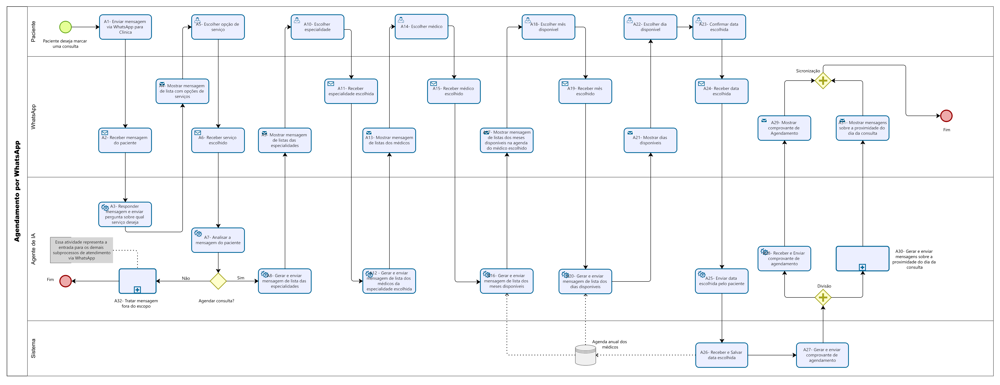
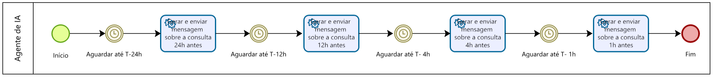

# 🏥 Sistema Inteligente de Agendamento de Consultas via WhatsApp

Este repositório apresenta a arquitetura de processos, modelagem analítica em notação BPMN e a especificação técnica de requisitos para um sistema inteligente de agendamento de consultas médicas via WhatsApp, utilizando um Agente de IA para automatizar o atendimento da Clínica MedLife.

---

## 💾 Downloads e Acesso Rápido

Acesse e baixe rapidamente a documentação técnica, os diagramas ou o arquivo fonte editável do projeto:

[-2ea44f?style=for-the-badge&logo=adobeacrobatreader&logoColor=white)](./engenharia-requisitos-clinica-medlife.pdf)

 

| Recurso / Artefato | Descrição | Link de Download / Visualização |
| :--- | :--- | :---: |
| 📄 **Documentação de Requisitos** | Especificação completa (KPIs, ROI, Histórias de Usuário, Gherkin) | [⬇️ Baixar PDF](./engenharia-requisitos-clinica-medlife.pdf) |
| 🔄 **Diagrama BPMN (Editável)** | Arquivo fonte do Bizagi / modelador BPMN | [⬇️ Baixar .BPMN](./diagrama-bpmn.bpmn) |
| 🖼️ **Fluxo Principal BPMN** | Imagem em alta resolução do fluxo principal | [🖼️ Baixar PNG](./diagrama-01.png) |
| 🖼️ **Subprocesso de Lembretes** | Imagem em alta resolução das notificações | [🖼️ Baixar PNG](./subtarefa-02.png) |

---

## 🎯 O Problema Resolvido

O projeto foi desenvolvido para solucionar gargalos identificados no processo de agendamento manual da clínica, tais como:

- Elevado tempo de atendimento (aproximadamente 10 minutos por agendamento);
- Dependência da secretária durante o horário comercial;
- Impossibilidade de agendamento fora do expediente (zonas de sombra);
- Alto índice de desistências durante o processo de marcação;
- Taxa significativa de absenteísmo (No-Show) por falta de lembretes.

Como solução, foi modelado um fluxo automatizado utilizando um Agente de IA integrado ao WhatsApp, capaz de realizar o agendamento de consultas 24 horas por dia, 7 dias por semana, além de enviar lembretes automáticos antes da consulta e encaminhar solicitações para outros serviços quando necessário.

---

## 🗺️ Modelagem do Processo (BPMN)

Abaixo está a representação visual dos fluxos modelados em BPMN 2.0.

### 📌 Fluxo Principal de Agendamento

  
   
  <small><i>Clique na imagem para abrir em tamanho cheio ou <a href="./diagrama-01.png" download>faça o download aqui</a>.</i></small>

---

### 📌 Subprocesso de Lembretes de Consulta

O processo principal possui um subprocesso responsável pelo agendamento e envio automático das notificações de proximidade da consulta (24h, 12h, 4h e 1h antes do atendimento).

  
   
  <small><i>Clique na imagem para abrir em tamanho cheio ou <a href="./subtarefa-02.png" download>faça o download aqui</a>.</i></small>

---

## 📊 Business Analytics

Durante a análise foram definidos indicadores de desempenho (KPIs) para mensurar os resultados da solução proposta.

### Resultados Esperados

- ⏱️ Redução do tempo médio de agendamento de **10 minutos para 3 minutos**;
- 📉 Redução da taxa de desistência via WhatsApp de **44% para menos de 15%**;
- 📅 Redução do índice de No-Show de **17% para menos de 4%**;
- 🌙 Atendimento disponível **24 horas por dia, 7 dias por semana**;
- 💰 Aumento da eficiência operacional e redução dos custos administrativos.

---

## 📑 Documentação Técnica Completa

A documentação foi organizada em artefatos separados para facilitar a leitura e consulta.

### 📄 Documento de Engenharia de Requisitos (PDF)

Contém:

- Business Analytics;
- Cenário AS-IS e TO-BE;
- KPIs do projeto;
- ROI estimado;
- Modelagem BPMN;
- Matriz de Requisitos Funcionais;
- Matriz de Requisitos Não Funcionais;
- Histórias de Usuário;
- Critérios de Aceite utilizando Gherkin (Dado / Quando / Então).

👉 [**Clique aqui para baixar o Documento Completo (engenharia-requisitos-clinica-medlife.pdf)**](./engenharia-requisitos-clinica-medlife.pdf)

---

## 🛠️ Ferramentas e Metodologias

---

## 👨‍💻 Autor

**Álvaro Costa**  
*Analista de Sistemas | Analista de Negócios e Requisitos*

Especializado em:
- Engenharia de Requisitos
- BPMN
- Business Analysis
- Modelagem de Processos
- Levantamento e Especificação de Requisitos
